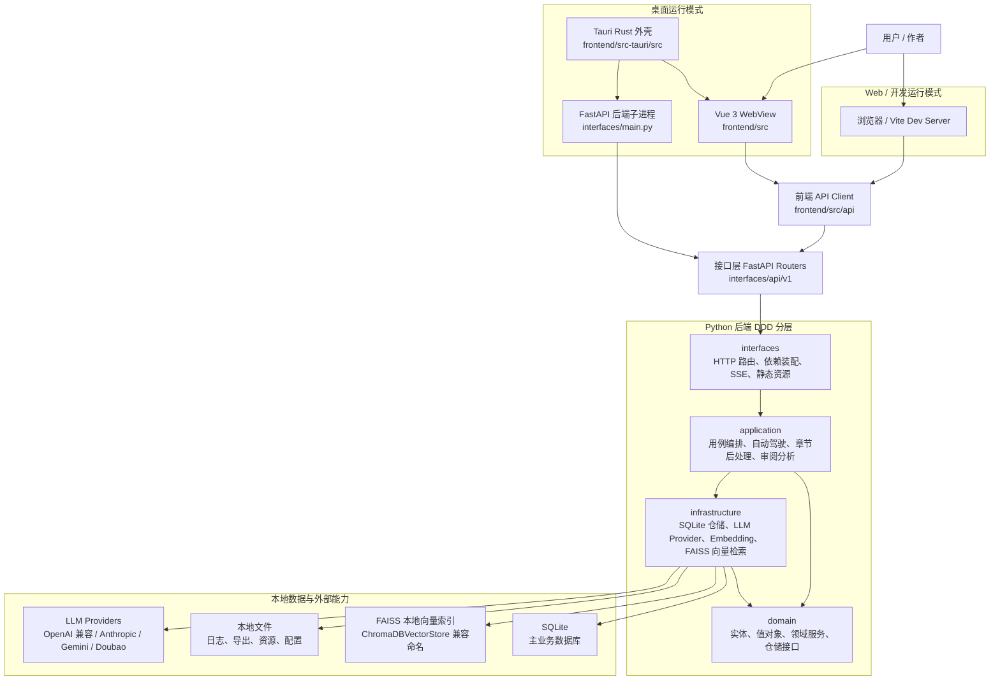
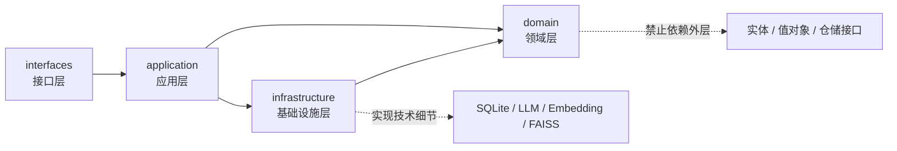
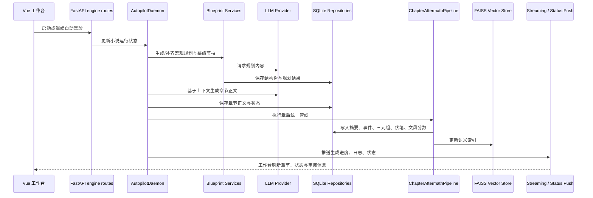
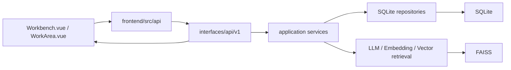
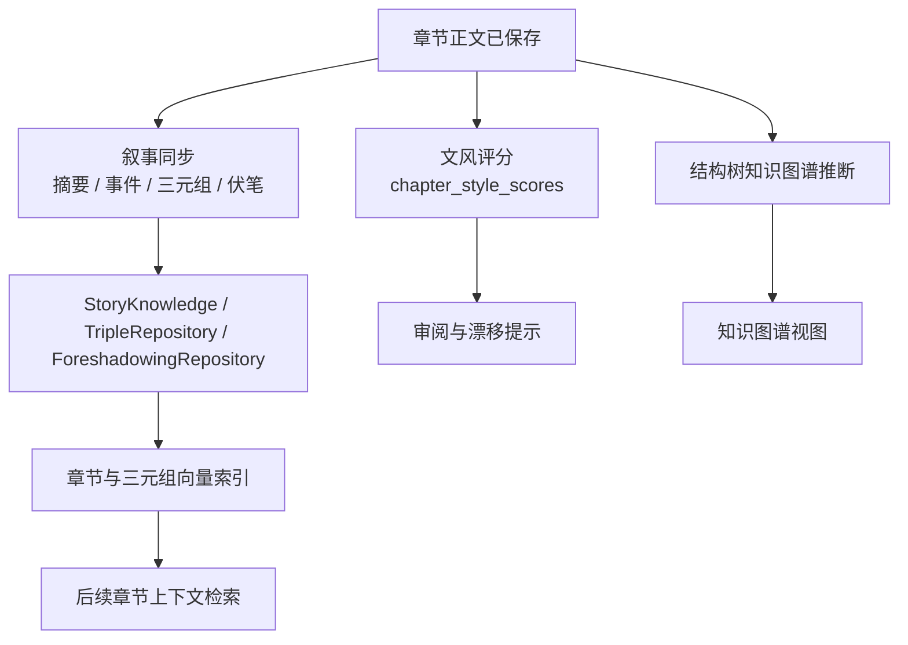

# PlotPilot 系统架构文档

PlotPilot（墨枢）是一个 AI 驱动的长篇创作平台，围绕“自动驾驶生成、知识图谱管理、风格与一致性分析、桌面端一键运行”组织系统能力。后端采用 DDD 四层架构，前端采用 Vue 3 工作台，桌面端通过 Tauri 管理 Python FastAPI 后端进程。

本文档按当前代码结构描述系统，不覆盖测试、生成物、`.understand-anything/`、`.venv/`、`tools/python_embed/` 等非生产运行内容。

## 总体架构图

## 运行模式

### 桌面模式

桌面端入口位于 `frontend/src-tauri/src`：

- `main.rs` 委托 `plotpilot_lib::run()` 启动 Tauri。
- `lib.rs` 注册窗口事件、Tauri commands、后端进程管理器和共享端口状态。
- `backend.rs` 负责查找/启动 FastAPI 后端，优先使用冻结后的 `plotpilot-backend.exe`，否则回退到内嵌 Python、虚拟环境或系统 Python。
- `commands.rs` 向前端暴露后端端口、后端状态、重启后端、环境检查、提取内嵌 Python、打开浏览器等命令。

桌面模式的关键设计是 sidecar：Rust 不承载业务逻辑，只管理 Python 后端生命周期、端口和退出清理。前端仍然通过 HTTP 调用 FastAPI。

### Web / 开发模式

前端入口位于 `frontend/src/main.ts`，使用 Vue 3、Pinia、Vue Router、Naive UI、ECharts。开发时可由 Vite 提供页面，API 请求通过 `frontend/src/api/config.ts` 统一指向后端地址。生产打包后，FastAPI 可托管 `frontend/dist` 静态资源并提供 SPA fallback。

## 后端分层

### `domain/` 领域层

领域层承载业务模型和规则，原则上不依赖外部技术实现。

主要职责：

- `domain/novel`: 小说、章节、剧情线、时间线、伏笔等核心创作模型。
- `domain/bible`: 设定库、人物、地点、关系等世界观模型。
- `domain/knowledge`: 章节摘要、知识三元组、知识来源等知识结构。
- `domain/ai`: LLM、Embedding、VectorStore 等能力接口和值对象。
- `domain/shared`: 基础实体、领域事件、共享异常。

### `application/` 应用层

应用层编排领域对象和基础设施能力，承接“用户想完成什么”的用例。

主要职责：

- `application/core`: 小说、章节、导出等基础用例。
- `application/blueprint`: 宏观规划、幕级规划、节拍表、卷摘要。
- `application/engine`: 自动驾驶守护进程、上下文构建、章节生成、流式状态、章节后处理。
- `application/world`: Bible、知识图谱、知识服务、世界观生成。
- `application/audit`: 章节审阅、陈词滥调扫描、宏观诊断与重构建议。
- `application/analyst`: 人物索引、文风分析、张力分析、三元组索引。
- `application/workbench`: 工作台上下文、沙盒对话、写作块等交互辅助能力。

### `infrastructure/` 基础设施层

基础设施层实现技术细节，不直接承载业务决策。

主要职责：

- `infrastructure/persistence/database`: SQLite 连接、仓储实现、三元组和知识图谱落库。
- `infrastructure/ai`: LLM Provider 工厂、OpenAI/Anthropic/Gemini 兼容封装、Embedding 服务、Prompt 管理。
- `infrastructure/ai/chromadb_vector_store.py`: 历史命名保留为 ChromaDBVectorStore，实际使用本地 FAISS 索引和 JSON 元数据管理向量检索。
- `infrastructure/persistence/mappers`: 领域对象与持久化结构之间的转换。

### `interfaces/` 接口层

接口层负责把外部请求转成应用层调用。

主要职责：

- `interfaces/main.py`: FastAPI 应用入口、环境初始化、日志、静态资源、路由注册、启动/关闭钩子。
- `interfaces/api/dependencies.py`: 依赖装配中心，组装仓储、应用服务、LLM Provider、向量服务等对象。
- `interfaces/api/v1`: 按 `core/world/blueprint/engine/audit/analyst/workbench` 划分 HTTP API。
- `interfaces/api/stats`: 统计相关路由、服务与仓储适配。

## 核心业务链路

### 自动驾驶生成链路

关键点：

- 守护进程负责阶段推进，不直接绕过应用服务和仓储边界。
- 章节正文保存后必须走统一章后处理管线，避免 HTTP 手动保存和自动驾驶保存出现逻辑漂移。
- 后处理管线集中处理摘要、叙事事件、三元组、伏笔、文风、知识图谱推断和向量索引更新。

### 手动写作 / 工作台链路

工作台是人工创作和 AI 辅助创作的中心界面。它通过前端 API 层调用后端路由，后端再装配应用服务完成章节保存、上下文预览、张力诊断、LLM 控制、宏观规划、知识图谱和伏笔台账等能力。

## 数据与状态

| 数据类型 | 主要位置 | 说明 |
| --- | --- | --- |
| 主业务数据 | SQLite | 小说、章节、Bible、结构树、审阅、知识、伏笔、三元组等 |
| 向量索引 | `VECTOR_STORE_PATH`，默认 `data/chromadb` | 兼容 ChromaDB 命名，内部使用 FAISS + JSON 元数据 |
| 前端状态 | Vue/Pinia | 当前小说、章节列表、工作台刷新状态、主题、模态框状态 |
| 运行状态 | SQLite + 内存对象 | 自动驾驶状态、后台任务、流式日志、断路器状态 |
| 日志 | `LOG_FILE` / `data/logs` | 后端启动、生成、诊断、异常与桌面端运行信息 |
| 发布数据目录 | `AITEXT_PROD_DATA_DIR` | 桌面 release 模式由 Tauri 注入，供后端定位可写数据目录 |

## LLM 与上下文系统

LLM 能力由领域接口和基础设施实现拆开：

- `domain/ai/services/llm_service.py` 定义抽象能力。
- `infrastructure/ai/provider_factory.py` 根据 LLM 控制面板配置创建 provider。
- `application/ai/llm_control_service.py` 管理模型配置、激活 profile、运行时摘要和连通性测试。
- `application/engine/services/context_builder.py` 与 `context_budget_allocator.py` 负责生成前的上下文组装和预算控制。
- `application/ai/vector_retrieval_facade.py`、章节索引服务、三元组索引服务负责把向量检索纳入上下文。

设计原则是：应用层决定“什么时候需要什么上下文”，基础设施层只负责“如何调用模型、如何检索、如何持久化”。

## 统一章后处理管线

章节保存后由 `application/engine/services/chapter_aftermath_pipeline.py` 统一收口。

该管线是系统一致性的关键边界：不论章节来自手动保存、托管连写还是自动驾驶，都应复用同一套后处理逻辑。

## 前端结构

| 目录 | 职责 |
| --- | --- |
| `frontend/src/api` | HTTP API 封装，隔离请求路径、参数和返回类型 |
| `frontend/src/components/workbench` | 主工作台、章节内容、结构树、伏笔、时间线、LLM 控制等 |
| `frontend/src/components/autopilot` | 自动驾驶状态、终端日志、断路器、流式内容、张力与文风提示 |
| `frontend/src/components/knowledge` | 知识库、知识图谱、三元组编辑和展示 |
| `frontend/src/components/graphs` | 人物/地点关系图 |
| `frontend/src/stores` | Pinia 状态，如主题和工作台刷新触发 |
| `frontend/src-tauri/src` | 桌面壳、后端 sidecar 管理、Tauri command |

## 架构约束

1. `domain/` 不依赖 FastAPI、SQLite、LLM SDK、前端或具体基础设施。
2. `application/` 可以编排领域对象和仓储/服务接口，但不应直接承载 HTTP 细节。
3. `infrastructure/` 实现外部系统和存储细节，避免把技术实现反向泄漏到领域层。
4. `interfaces/` 只做请求解析、依赖注入、响应封装和运行时钩子，不沉淀核心业务规则。
5. 自动驾驶、手动保存、托管连写必须共享章后处理管线。
6. 前端 API 封装应集中在 `frontend/src/api`，组件只关心交互状态和展示。
7. 桌面端 Rust 只管理窗口、命令和后端进程生命周期，不复制 Python 业务逻辑。

## 典型入口

| 场景 | 入口 |
| --- | --- |
| 后端 API | `interfaces/main.py` |
| 依赖装配 | `interfaces/api/dependencies.py` |
| 自动驾驶守护进程 | `application/engine/services/autopilot_daemon.py` |
| 章后处理 | `application/engine/services/chapter_aftermath_pipeline.py` |
| LLM 控制 | `application/ai/llm_control_service.py` |
| 前端启动 | `frontend/src/main.ts` |
| 工作台主界面 | `frontend/src/views/Workbench.vue`、`frontend/src/components/workbench/WorkArea.vue` |
| 桌面启动 | `frontend/src-tauri/src/main.rs`、`frontend/src-tauri/src/lib.rs` |
